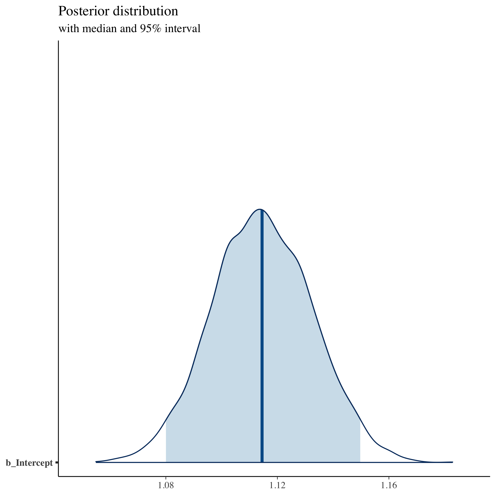

```r
## ---------------------------
## libraries
## ---------------------------

libs <- c("tidyverse", "brms", "haven", "bayesplot")
sapply(libs, require, character.only = TRUE)
```

```
## Loading required package: tidyverse
```

```
## ── Attaching core tidyverse packages ──────────────────────── tidyverse 2.0.0 ──
## ✔ dplyr     1.1.3     ✔ readr     2.1.4
## ✔ forcats   1.0.0     ✔ stringr   1.5.0
## ✔ ggplot2   3.4.4     ✔ tibble    3.2.1
## ✔ lubridate 1.9.3     ✔ tidyr     1.3.0
## ✔ purrr     1.0.2     
## ── Conflicts ────────────────────────────────────────── tidyverse_conflicts() ──
## ✖ dplyr::filter() masks stats::filter()
## ✖ dplyr::lag()    masks stats::lag()
## ℹ Use the conflicted package (<http://conflicted.r-lib.org/>) to force all conflicts to become errors
## Loading required package: brms
## 
## Loading required package: Rcpp
## 
## Loading 'brms' package (version 2.20.4). Useful instructions
## can be found by typing help('brms'). A more detailed introduction
## to the package is available through vignette('brms_overview').
## 
## 
## Attaching package: 'brms'
## 
## 
## The following object is masked from 'package:stats':
## 
##     ar
## 
## 
## Loading required package: haven
## 
## Loading required package: bayesplot
## 
## This is bayesplot version 1.10.0
## 
## - Online documentation and vignettes at mc-stan.org/bayesplot
## 
## - bayesplot theme set to bayesplot::theme_default()
## 
##    * Does _not_ affect other ggplot2 plots
## 
##    * See ?bayesplot_theme_set for details on theme setting
## 
## 
## Attaching package: 'bayesplot'
## 
## 
## The following object is masked from 'package:brms':
## 
##     rhat
```

```
## tidyverse      brms     haven bayesplot 
##      TRUE      TRUE      TRUE      TRUE
```


```r
## ---------------------------
## settings
## ---------------------------

## set number of cores to use to speed things up
options(mc.cores=parallel::detectCores())

## set a seed so things stay the same
my_seed <- 20231118
```


```r
## ---------------------------
## input
## ---------------------------

## using Stata version of data so we have labels; need haven::read_dta()
df <- read_dta("hsls_small.dta")
```


```r
## ---------------------------
## show data set
## ---------------------------

df
```

```
## # A tibble: 23,503 × 16
##    stu_id x1sex      x1race   x1stdob x1txmtscor x1paredu x1hhnumber x1famincome
##    <chr>  <dbl+lbl>  <dbl+lb> <chr>   <dbl+lbl>  <dbl+lb> <dbl+lbl>  <dbl+lbl>  
##  1 10001  1 [Male]   8 [Whit… 199502  59.4       5 [Mast… 3 [3 Hous… 10 [Family…
##  2 10002  2 [Female] 8 [Whit… 199511  47.7       3 [Asso… 6 [6 Hous…  3 [Family…
##  3 10003  2 [Female] 3 [Blac… 199506  64.2       7 [Ph.D… 3 [3 Hous…  6 [Family…
##  4 10004  2 [Female] 8 [Whit… 199505  49.3       4 [Bach… 2 [2 Hous…  5 [Family…
##  5 10005  1 [Male]   8 [Whit… 199505  62.6       4 [Bach… 4 [4 Hous…  9 [Family…
##  6 10006  2 [Female] 8 [Whit… 199504  58.1       3 [Asso… 6 [6 Hous…  5 [Family…
##  7 10007  2 [Female] 8 [Whit… 199409  49.5       2 [High… 2 [2 Hous…  4 [Family…
##  8 10008  1 [Male]   8 [Whit… 199410  54.6       7 [Ph.D… 3 [3 Hous…  7 [Family…
##  9 10009  1 [Male]   8 [Whit… 199501  53.2       2 [High… 3 [3 Hous…  4 [Family…
## 10 10010  2 [Female] 8 [Whit… 199503  63.8       3 [Asso… 4 [4 Hous…  4 [Family…
## # ℹ 23,493 more rows
## # ℹ 8 more variables: x1poverty185 <dbl+lbl>, x1ses <dbl+lbl>,
## #   x1stuedexpct <dbl+lbl>, x1paredexpct <dbl+lbl>, x1region <dbl+lbl>,
## #   x4hscompstat <dbl+lbl>, x4evratndclg <dbl+lbl>, x4hs2psmos <dbl+lbl>
```


```r
## ---------------------------
## simple regression
## ---------------------------

## likelihood of going to college
fit <- brm(x4evratndclg ~ 1,
           data = df |> zap_labels(),
           family = bernoulli("logit"),
           seed = my_seed)
```

```
## Warning: Rows containing NAs were excluded from the model.
```


```r
## show summary stats
summary(fit)
```

```
##  Family: bernoulli 
##   Links: mu = logit 
## Formula: x4evratndclg ~ 1 
##    Data: zap_labels(df) (Number of observations: 17335) 
##   Draws: 4 chains, each with iter = 2000; warmup = 1000; thin = 1;
##          total post-warmup draws = 4000
## 
## Population-Level Effects: 
##           Estimate Est.Error l-95% CI u-95% CI Rhat Bulk_ESS Tail_ESS
## Intercept     1.11      0.02     1.08     1.15 1.00     1434     2080
## 
## Draws were sampled using sampling(NUTS). For each parameter, Bulk_ESS
## and Tail_ESS are effective sample size measures, and Rhat is the potential
## scale reduction factor on split chains (at convergence, Rhat = 1).
```

```r
## show distribution of intercept (our main parameter)
mcmc_areas(fit, prob = 0.95, pars = "b_Intercept") +
  labs(
    title = "Posterior distribution",
    subtitle = "with median and 95% interval"
  )
```




```r
## show trace of chains for intercept (our main parameter)
color_scheme_set("mix-blue-pink")
mcmc_trace(fit |> as_draws(inc_warmup = TRUE),
           pars = "b_Intercept", n_warmup = 1000,
           window = c(0, 50)) +
  labs(
    title = "Trace of posterior chains",
    subtitle = "Draws: 0 to 50"
  )
```


```r
## show trace of chains for intercept (our main parameter)
color_scheme_set("mix-blue-pink")
mcmc_trace(fit |> as_draws(inc_warmup = TRUE),
           pars = "b_Intercept", n_warmup = 1000,
           window = c(500, 2000)) +
  labs(
    title = "Trace of posterior chains",
    subtitle = "Draws: 500 to 2000"
  )
```


```r
## convert to posterior prediction
ppc_dens_overlay(y = fit$y,
                 yrep = posterior_predict(fit, draws = 50))
```

```
## Error in validate_y(y): is.numeric(y) is not TRUE
```


<!-- 1. Regression  -->
<!--    1. Simple -->
<!--    2. Random intercepts -->
<!--    3. Random slopes  -->
<!-- 2. Model checking -->
<!-- 3. Posterior distribution manipulation  -->
<!-- 4. Posterior predictive distributions -->


