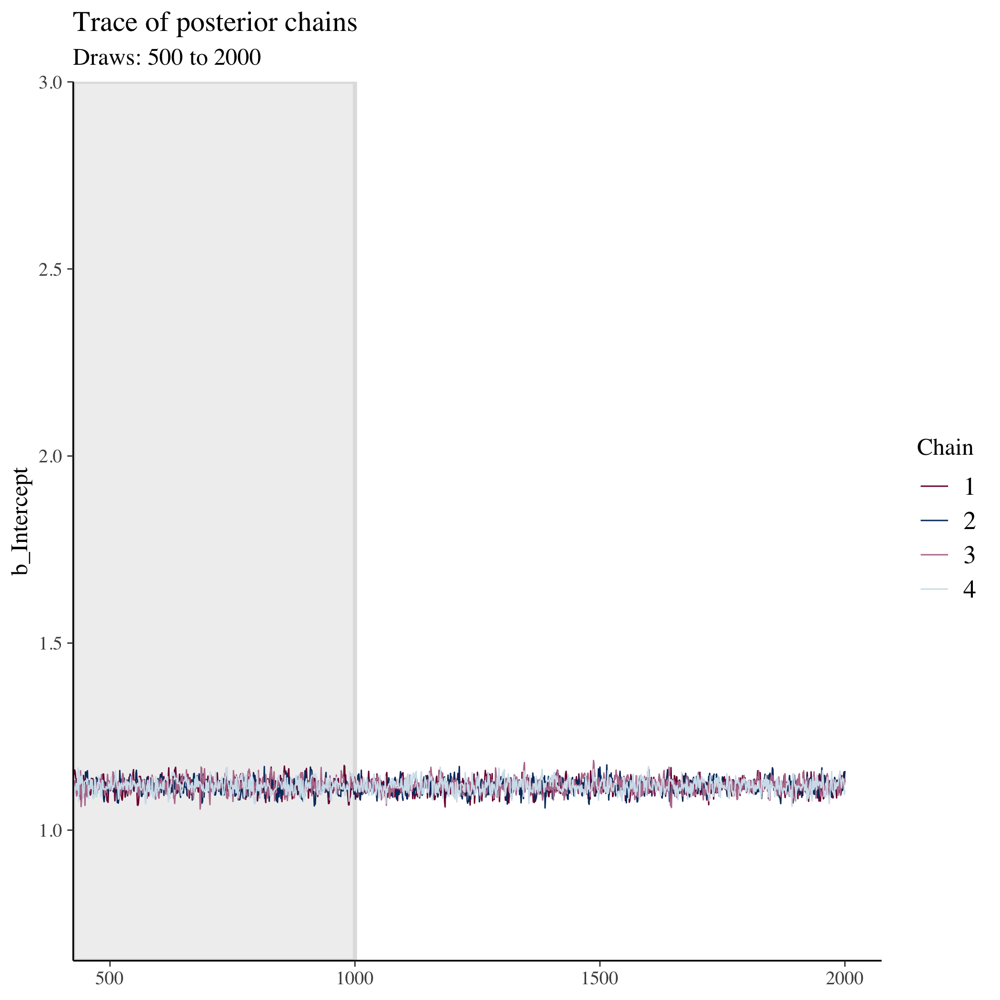
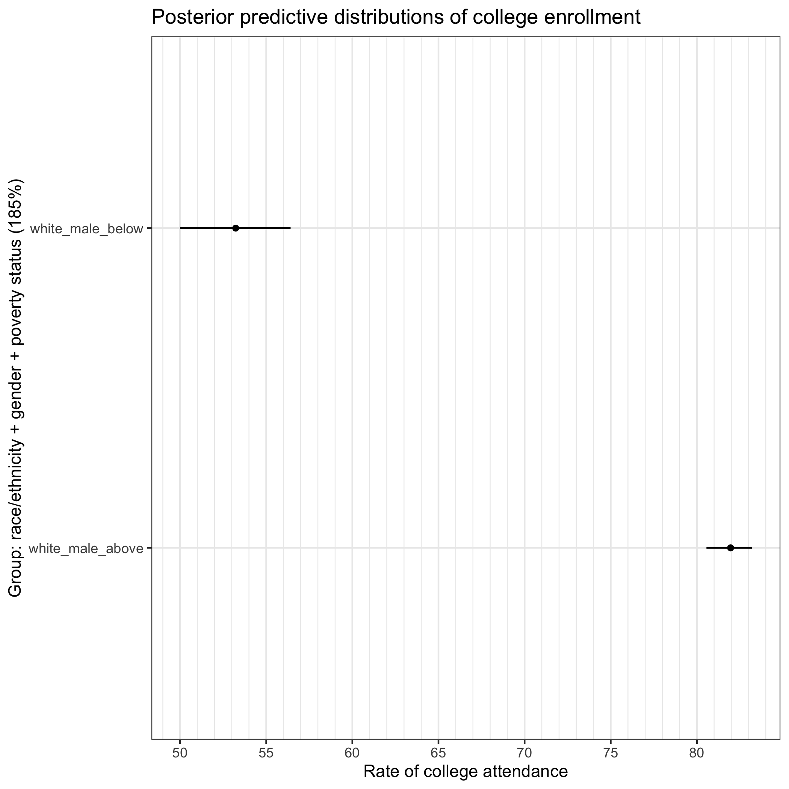

In this part of the workshop, we'll work through a couple of examples of a
Bayesian analysis. The first will be a very simple regression and the second a
more complex regression with deep interactions. We'll also consider a few model
checks and ways of presenting the results.


## Libraries

We'll load a few libraries for our analysis:

- _tidyverse_: useful for data wrangling
- _brms_: our main Bayesian regression tool
- _bayesplot_: support library for plotting Bayesian results
- _tidybayes_: support library for wrangling/plotting Bayesian results
- _patchwork_: combine plots
- _shinystan_: interactive inspection of Bayesian objects
- _parallel_: take advantage of multiple cores

If you don't have these libraries, you can install them quickly with the
following:

```r
install.packages(c("tidyverse", "brms", "bayesplot", "tidybayes", "patchwork", "shinystan", "parallel"), dependencies = TRUE)

```


```r
## ---------------------------
## libraries
## ---------------------------

libs <- c("tidyverse", "brms", "bayesplot", "tidybayes", "patchwork","shinystan")
sapply(libs, require, character.only = TRUE)
```

```
## Loading required package: tidyverse
```

```
## ── Attaching core tidyverse packages ──────────────────────── tidyverse 2.0.0 ──
## ✔ dplyr     1.1.3     ✔ readr     2.1.4
## ✔ forcats   1.0.0     ✔ stringr   1.5.0
## ✔ ggplot2   3.4.4     ✔ tibble    3.2.1
## ✔ lubridate 1.9.3     ✔ tidyr     1.3.0
## ✔ purrr     1.0.2     
## ── Conflicts ────────────────────────────────────────── tidyverse_conflicts() ──
## ✖ dplyr::filter() masks stats::filter()
## ✖ dplyr::lag()    masks stats::lag()
## ℹ Use the conflicted package (<http://conflicted.r-lib.org/>) to force all conflicts to become errors
## Loading required package: brms
## 
## Loading required package: Rcpp
## 
## Loading 'brms' package (version 2.20.4). Useful instructions
## can be found by typing help('brms'). A more detailed introduction
## to the package is available through vignette('brms_overview').
## 
## 
## Attaching package: 'brms'
## 
## 
## The following object is masked from 'package:stats':
## 
##     ar
## 
## 
## Loading required package: bayesplot
## 
## This is bayesplot version 1.10.0
## 
## - Online documentation and vignettes at mc-stan.org/bayesplot
## 
## - bayesplot theme set to bayesplot::theme_default()
## 
##    * Does _not_ affect other ggplot2 plots
## 
##    * See ?bayesplot_theme_set for details on theme setting
## 
## 
## Attaching package: 'bayesplot'
## 
## 
## The following object is masked from 'package:brms':
## 
##     rhat
## 
## 
## Loading required package: tidybayes
## 
## 
## Attaching package: 'tidybayes'
## 
## 
## The following objects are masked from 'package:brms':
## 
##     dstudent_t, pstudent_t, qstudent_t, rstudent_t
## 
## 
## Loading required package: patchwork
## 
## Loading required package: shinystan
## 
## Loading required package: shiny
## 
## 
## This is shinystan version 2.6.0
```

```
## tidyverse      brms bayesplot tidybayes patchwork shinystan 
##      TRUE      TRUE      TRUE      TRUE      TRUE      TRUE
```

## Settings

We have a couple of settings that will help us. First, we'll take advantage of
our computers' multiple cores with `options(mc.cores=parallel::detectCores())`.

Because the estimation of Bayesian models involve pseudorandom computational
processes, we'll set a seed so that we get the same results. 


```r
## ---------------------------
## settings
## ---------------------------

## set number of cores to use to speed things up
options(mc.cores=parallel::detectCores())

## set a seed so things stay the same
my_seed <- 20231118
```

## Data

The data we're using today is a simplified version of HSLS09. Observations with
missing data have been dropped. We're also not accounting for the weighting
scheme used by NCES.


```r
## ---------------------------
## input
## ---------------------------

df <- readRDS("college.RDS")
```


```r
## ---------------------------
## show data set
## ---------------------------

df
```

```
## # A tibble: 17,202 × 7
##       id gender raceeth birthyr pov185 region    college
##    <int> <chr>  <chr>     <int> <chr>  <chr>       <dbl>
##  1 10001 male   white      1995 above  midwest         1
##  2 10002 female white      1995 below  northeast       1
##  3 10003 female blackaa    1995 above  west            1
##  4 10004 female white      1995 above  south           0
##  5 10005 male   white      1995 above  south           0
##  6 10007 female white      1994 above  northeast       1
##  7 10008 male   white      1994 above  northeast       1
##  8 10009 male   white      1995 above  south           1
##  9 10012 female white      1995 above  midwest         1
## 10 10013 male   white      1995 above  south           1
## # ℹ 17,192 more rows
```

## Simple regression

As a first step, we'll fit a regression of college attendance on a vector of
ones (intercept only model). This will give us the average attendance across the
full sample, with measure of uncertainty in the spread of the posterior
distribution.

With Bayesian models, we have to be a little more particular with our
distributional assumptions. Since our outcomes fall into 0s and 1s, we should
use a [Bernoulli
distribution](https://en.wikipedia.org/wiki/Bernoulli_distribution) with a logit
link function for our likelihood in the `family` argument:

$$
f(k;p) = p^k(1-p)^{1-k}\, \text{for}\, k \in {0,1}
$$

We know our _k_ values here (0 for no college attendance and 1 for attendance).
Our unknown is _p_, the probability of attendance. 

### Running the model


```r
## -----------------------------------------------------------------------------
## simple regression: intercept only (average college-going rate)
## -----------------------------------------------------------------------------

## likelihood of going to college
fit <- brm(college ~ 1,
           data = df,
           family = bernoulli("logit"),
           seed = my_seed)
```

You should notice a few things. First, your model has to be compiled to a faster
coding language. For short models, it can take longer to compile than to run,
but for longer models, this isn't the case. You can also save the models so that
you don't have recompile each time.

Once it starts to run, you'll see a lot of information about leapfrog steps,
chains, warm-ups, and samples. We'll discuss some of these pieces and what they
mean in just a bit, but first we'll take a look at the summary statistics.


```r
## show summary stats
summary(fit)
```

```
##  Family: bernoulli 
##   Links: mu = logit 
## Formula: college ~ 1 
##    Data: df (Number of observations: 17202) 
##   Draws: 4 chains, each with iter = 2000; warmup = 1000; thin = 1;
##          total post-warmup draws = 4000
## 
## Population-Level Effects: 
##           Estimate Est.Error l-95% CI u-95% CI Rhat Bulk_ESS Tail_ESS
## Intercept     1.12      0.02     1.08     1.15 1.00     1534     1792
## 
## Draws were sampled using sampling(NUTS). For each parameter, Bulk_ESS
## and Tail_ESS are effective sample size measures, and Rhat is the potential
## scale reduction factor on split chains (at convergence, Rhat = 1).
```

The intercept value is approximately 1.12. Remembering that this is on the logit
scale, we can covert this using an inverse logit transformation:

**Logit**

$$
ln(\frac{p}{1-p})
$$

**Inverse logit**

$$
\frac{1}{1 + e^{-x}}
$$


```r
## helper function: inverse logit
inv_logit <- function(x) { 1 / (1 + exp(-x)) }

## convert intercept value to probability scale
inv_logit(1.12)
```

```
## [1] 0.7539887
```

Approximately 75% of the sample attended college at some point. We also have an
estimated error of approximately 0.02 (back on the log scale). So far, this
seems much like you may be used seeing after fitting frequentist models. But
what is `Rhat`, `Bulk_ESS`, and `Tail_ESS`? Further, what is the meaning of all
the information in the `Draws`?

### A quick note on how we actually estimate the posterior

In applied Bayesian work, the posterior distribution, which is proportional to
the prior multiplied by the likelihood distributions, often doesn't have a
**closed form solution**. This just means we can't solve for the posterior using
analytic methods (e.g., algebraic equations). Instead, we are forced to sample
from the posterior and build an empirical distribution of our best guesses. This
is easier said than done because, remember, we don't know the answer.

Imagine I put you in a dark room and told you that I wanted you to be able to
describe the space to me. I assume the floor generally slopes to a low point, so
you'll probably make your way there. That said, the room may have dips in the
floor or weird corners. It also may be the size of a typical classroom or the
size of a football field. And also, I don't have infinite time or money for your
to spend your time figuring it out. How do you explore the space in way that's
complete but also efficient?

This is basically the problem facing applied Bayesian work. With the advent of
modern computing, we have a number of approaches. We unfortunately don't have
time to get into the nuances, benefits, and drawbacks of various samplers. The
main thing to know is that most make use of Markov chain Monte Carlo (MCMC)
chains and, as a result, return multiple "guesses" of our unknown parameters.
When we see the `Estimate` and `Est.Error` values in the results, these are
summary statistics of a full distribution of results.

_Why multiple chains?_: Let's go back to the room. If you only have so much time
to explore the room, where you start may influence where you explore. You may
not find the low point in the floor or you may get stuck in a corner. How do I
know you are giving me an accurate account of the room? But if you can start
multiple times in multiple places and end with similar results, that feels like
evidence you are describing the space, or at least the main features. This is
the logic behind running multiple chains.

Let's look at beginning of the chains with a **trace plot**, the first 50
samples:


```r
## show trace of chains for intercept (our main parameter)
color_scheme_set("mix-blue-pink")
mcmc_trace(fit |> as_draws(inc_warmup = TRUE),
           pars = "b_Intercept", n_warmup = 1000,
           window = c(0, 50)) +
  labs(
    title = "Trace of posterior chains",
    subtitle = "Draws: 0 to 50"
  )
```


Notice how the four chains start in very different places. But very quickly for
this simple model they collectively **converge** to a similar area. Let's look
at the rest of the samples:


```r
## show trace of chains for intercept (our main parameter)
color_scheme_set("mix-blue-pink")
mcmc_trace(fit |> as_draws(inc_warmup = TRUE),
           pars = "b_Intercept", n_warmup = 1000,
           window = c(500, 2000)) +
  labs(
    title = "Trace of posterior chains",
    subtitle = "Draws: 500 to 2000"
  )
```



Because we purposefully start the chains in different spots, we shouldn't think
those early samples represent the posterior. We throw these out as **warmup**
and only keep the later samples which are combined into our **total post-warmup
draws**. In this model, we end up with 4,000 sample draws of our posterior.

Seeing the consistent overlap or **mixing** of the chains, we feel we have a
well-performing model (at least in terms of computation). The `Rhat` statistic
gives us a more formal test of the ratio of between chain variance to within
chain variance. `Rhat` measures below 1.1 suggest we have good mixture. The two
ESS measures stand for **Effective Sample Size**. Due to the deterministic
nature of our sampler (and most samplers), the draws in our sample distribution
aren't entirely independent. `Bulk_ESS` sample size gives us the overall
effective sample size while `Tail_ESS` gives an estimate of effective sample
size in the tails of the distribution.

### Plotting the posterior

Since our Bayesian posterior represents a distribution of samples, let's look at
it graphically.


```r
## show distribution of intercept (our main parameter)
mcmc_areas(fit, prob = 0.95, pars = "b_Intercept") +
  labs(
    title = "Posterior distribution (log scale)",
    subtitle = "with median and 95% interval"
  )
```


As a quick trick, we'll use the `transformation` argument and our `inv_logit()`
function to see the posterior on the probability scale.


```r
## show distribution of transformed intercept (our main parameter)
## using helper function
mcmc_areas(fit, prob = 0.95, pars = "b_Intercept",
           transformation = list("b_Intercept" = inv_logit)) +
  labs(
    title = "Posterior distribution (probability)",
    subtitle = "with median and 95% interval; prior: student_t(0,3,2.5)"
  )
```


### Priors

What about priors? Don't we have to set those? By default, `brm()` will choose a
set of **weakly informative** priors based on the likelihood distribution you
set. You can check this after the fact using `prior_summary()`.


```r
## ---------------------------
## check prior
## ---------------------------

## show prior from first model
prior_summary(fit)
```

```
## Intercept ~ student_t(3, 0, 2.5)
```

Let's change our prior to normal distribution with a wide variance (remember:
we're on a logit scale).


```r
## change to normal prior for comparison
fit <- brm(college ~ 1,
           data = df,
           family = bernoulli("logit"),
           seed = my_seed,
           prior = set_prior("normal(0,20)", class = "Intercept"))
```

```
## Compiling Stan program...
```

```
## Start sampling
```

```r
## check prior
prior_summary(fit)
```

```
## Intercept ~ normal(0,20)
```

```r
## show summary stats
summary(fit)
```

```
##  Family: bernoulli 
##   Links: mu = logit 
## Formula: college ~ 1 
##    Data: df (Number of observations: 17202) 
##   Draws: 4 chains, each with iter = 2000; warmup = 1000; thin = 1;
##          total post-warmup draws = 4000
## 
## Population-Level Effects: 
##           Estimate Est.Error l-95% CI u-95% CI Rhat Bulk_ESS Tail_ESS
## Intercept     1.12      0.02     1.08     1.15 1.00     1498     2192
## 
## Draws were sampled using sampling(NUTS). For each parameter, Bulk_ESS
## and Tail_ESS are effective sample size measures, and Rhat is the potential
## scale reduction factor on split chains (at convergence, Rhat = 1).
```

```r
## show distribution of transformed intercept (our main parameter)
## using helper function
mcmc_areas(fit, prob = 0.95, pars = "b_Intercept",
           transformation = list("b_Intercept" = inv_logit)) +
  labs(
    title = "Posterior distribution (probability)",
    subtitle = "with median and 95% interval; prior: normal(0,20)",
  )
```


The posterior is largely the same. It may have taken slightly longer or shorter
to run the sampler, but again, for this model it's almost imperceptible. For
more complex models, however, prior selection can be the difference between a
model that converges and one that doesn't. You can also be more specific with
your priors. But for now, we'll keep using the defaults.

### Posterior check

Bayesians often talk about accurately modeling the **data generating process**.
You can think about your model being a machine that, if accurately built and
tuned, can be reversed to make predictions (new data) that look like what you
observed. If posterior predictions look quite different from what you observed
in your data, that's evidence you don't have a good model of the world that
produced your data.

We can check this by producing a number of predictions from our fitted model
using `posterior_epred()` and comparing it to our empirical mean of college
enrollment.


```r
## ---------------------------
## posterior predictive check
## ---------------------------

## plot our posterior predictive values against the college-going rate
## that is observed in the data
ppc_stat(y = df |> pull(college) |> c(),
         yrep = posterior_epred(fit),
         stat = mean)
```

```
## `stat_bin()` using `bins = 30`. Pick better value with `binwidth`.
```


Seeing that the distribution of our predictions $y^{rep}$ splits $y$, we have
evidence that our machine/model is well specified.


## Speed up trick

An unfortunate thing about Bayesian samplers is that they don't scale well with
data size. In some cases --- such as our own --- we can exploit connections
between distributions and sufficient statistics to make our data matrix smaller
and therefore sampler faster.

A Bernoulli distribution (coin flip) can be thought of a binomial distribution
(successes out of trials) in which there is only one trial. By collapsing our
data to a single row of the number of students who went to college out of the
total, we can rewrite our model and speed it up.


```r
## -----------------------------------------------------------------------------
## speed up trick
## -----------------------------------------------------------------------------

## since we're using categorical variables (rather than continuous variables),
## collapse binary data (bernoulli) into smaller data set of successes/trials
## (binomial) to take advantage of sufficient statistics
df_tmp <- df |>
  summarise(college = sum(college),
            n = n())

## likelihood of going to college using binomial
fit <- brm(college | trials(n) ~ 1,
           data = df_tmp,
           family = binomial("logit"),
           seed = my_seed)
```

```
## Compiling Stan program...
```

```
## Start sampling
```

```r
## show summary stats
summary(fit)
```

```
##  Family: binomial 
##   Links: mu = logit 
## Formula: college | trials(n) ~ 1 
##    Data: df_tmp (Number of observations: 1) 
##   Draws: 4 chains, each with iter = 2000; warmup = 1000; thin = 1;
##          total post-warmup draws = 4000
## 
## Population-Level Effects: 
##           Estimate Est.Error l-95% CI u-95% CI Rhat Bulk_ESS Tail_ESS
## Intercept     1.12      0.02     1.08     1.15 1.00     1533     2023
## 
## Draws were sampled using sampling(NUTS). For each parameter, Bulk_ESS
## and Tail_ESS are effective sample size measures, and Rhat is the potential
## scale reduction factor on split chains (at convergence, Rhat = 1).
```

As we can see, we get the same results. We'll use this speed up trick with our
more complex model below.

## Multiple regression model with deep interactions

In this model, we'll interact our categorical indicators for race/ethnicity,
gender, and poverty status. We'll include main effects for each characteristic
individually, but also random intercept adjustments for interactions for each
group. These random effects will be especially important for providing estimates
for small groups.


```r
## -----------------------------------------------------------------------------
## multiple regression across groups
## -----------------------------------------------------------------------------

## collapse into groups of race/ethnicity by gender by poverty level
df_tmp <- df |>
  group_by(raceeth, gender, pov185) |>
  summarise(college = sum(college),
            n = n(),
            .groups = "drop")

## likelihood of going to college using binomial
fit <- brm(college | trials(n) ~ raceeth + gender + pov185 +
             (1 | raceeth:gender:pov185),
           data = df_tmp,
           family = binomial("logit"),
           seed = my_seed)
```

```
## Compiling Stan program...
```

```
## Start sampling
```

```r
## show summary stats
summary(fit)
```

```
##  Family: binomial 
##   Links: mu = logit 
## Formula: college | trials(n) ~ raceeth + gender + pov185 + (1 | raceeth:gender:pov185) 
##    Data: df_tmp (Number of observations: 52) 
##   Draws: 4 chains, each with iter = 2000; warmup = 1000; thin = 1;
##          total post-warmup draws = 4000
## 
## Group-Level Effects: 
## ~raceeth:gender:pov185 (Number of levels: 52) 
##               Estimate Est.Error l-95% CI u-95% CI Rhat Bulk_ESS Tail_ESS
## sd(Intercept)     0.11      0.04     0.04     0.18 1.00      984      649
## 
## Population-Level Effects: 
##                Estimate Est.Error l-95% CI u-95% CI Rhat Bulk_ESS Tail_ESS
## Intercept          1.46      0.21     1.03     1.89 1.01      717     1389
## raceethasian       1.75      0.23     1.30     2.21 1.00      785     1665
## raceethblackaa     0.47      0.22     0.05     0.91 1.00      769     1481
## raceethhispnr      0.40      0.25    -0.09     0.91 1.00      913     1866
## raceethhisprs      0.48      0.22     0.05     0.91 1.01      697     1508
## raceethmoretor     0.59      0.22     0.15     1.03 1.00      759     1412
## raceethnhpi        0.27      0.35    -0.41     0.99 1.00     1379     2329
## raceethunknown     1.00      0.25     0.52     1.48 1.00      904     1684
## raceethwhite       0.50      0.22     0.07     0.93 1.01      702     1532
## gendermale        -0.48      0.06    -0.59    -0.37 1.00     2653     2620
## pov185below       -1.21      0.08    -1.35    -1.06 1.00     1992     2762
## pov185unknown     -1.30      0.08    -1.44    -1.14 1.00     1869     2048
## 
## Draws were sampled using sampling(NUTS). For each parameter, Bulk_ESS
## and Tail_ESS are effective sample size measures, and Rhat is the potential
## scale reduction factor on split chains (at convergence, Rhat = 1).
```

### Shiny Stan

A wonderful tool for inspecting our model fit is Shiny Stan. It performs many of
the checks we performed before plus many more in an interactive browser window.
To open the program, type the following on the console line:

```r
launch_shinystan(fit)
```

### Predictions

To make these marginal effect estimates easier to interpret, we'll produce
posterior predictions again. One thing that's very easy to do with a model like
this is make predictions even for groups that aren't observed in the data. To do
that, we will make a design matrix that includes all possible combinations of
the demographic characteristics we modeled.

After that, we'll produce a plot showing the posterior predictions for each
group.


```r
## ---------------------------
## posterior predictions
## ---------------------------

## create a design matrix (data frame) of all possible groups in our model
df_design <- expand.grid(raceeth = df |> distinct(raceeth) |> pull() |> c(),
                         gender = df |> distinct(gender) |> pull() |> c(),
                         pov185 = df |> distinct(pov185) |> pull() |> c(),
                         stringsAsFactors = FALSE) |>
  as_tibble() |>
  arrange(raceeth, gender, pov185) |>
  mutate(n = 100,
         group = paste(raceeth, gender, pov185, sep = "_"))

## get posterior predictions but in long form that's better for plotting
pp <- df_design |>
  add_epred_draws(fit,
                  ndraws = 500,
                  allow_new_levels = TRUE)

## compute mean posterior by group to get order for plot
pp_mean <- pp |>
  summarise(pp_mean = mean(.epred),
            .groups = "drop") |>
  arrange(pp_mean) |>
  mutate(plot_index = row_number(),
         plot_index = factor(plot_index,
                             levels = plot_index,
                             labels = group)) |>
  select(group, pp_mean, plot_index)
```


```r
## join means back to main pp tibble and plot densities for each group
bayes_g <- pp |>
  left_join(pp_mean, by = "group") |>
  ggplot(aes(y = plot_index, x = .epred)) +
  stat_pointinterval(.width = 0.95, linewidth = 0.7, size = 1) +
  scale_x_continuous(breaks = seq(0, 100, 10),
                     minor_breaks = seq(0, 100, 5)) +
  labs(
    title = "Posterior predictive distributions of college enrollment",
    y = "Group: race/ethnicity + gender + poverty status (185%)",
    x = "Rate of college attendance"
  ) +
  theme_bw()
bayes_g
```


### Compare to frequentist analysis

Inevitably, we (or a reviewer!) will want a comparison with a frequentist model.
I will tell you know that this is a fool's errand full of philosophical,
statistical, and computational pitfalls and incommensurabilities. But
nonetheless, let's see how this sort of analysis might look in a frequentist
model (as close as we can approximate anyway).


```r
## -----------------------------------------------------------------------------
## quick comparison to frequentist approach
## -----------------------------------------------------------------------------

## fit logit model
lm_fit <- glm(cbind(college, n - college) ~ raceeth * gender * pov185,
              data = df_tmp,
              family = binomial("logit"))

## show summary
summary(lm_fit)
```

```
## 
## Call:
## glm(formula = cbind(college, n - college) ~ raceeth * gender * 
##     pov185, family = binomial("logit"), data = df_tmp)
## 
## Coefficients: (2 not defined because of singularities)
##                                           Estimate Std. Error z value Pr(>|z|)
## (Intercept)                              2.079e+00  7.500e-01   2.773  0.00556
## raceethasian                             1.048e+00  7.923e-01   1.323  0.18598
## raceethblackaa                          -2.652e-01  7.674e-01  -0.346  0.72965
## raceethhispnr                           -9.808e-01  1.377e+00  -0.712  0.47625
## raceethhisprs                           -1.215e-01  7.628e-01  -0.159  0.87345
## raceethmoretor                          -1.515e-01  7.657e-01  -0.198  0.84311
## raceethnhpi                              6.931e-01  1.275e+00   0.544  0.58661
## raceethunknown                           2.182e+01  6.648e+04   0.000  0.99974
## raceethwhite                             3.918e-02  7.524e-01   0.052  0.95847
## gendermale                              -1.192e+00  8.742e-01  -1.364  0.17265
## pov185below                             -2.166e+00  8.583e-01  -2.524  0.01160
## pov185unknown                           -1.520e+00  9.774e-01  -1.555  0.11996
## raceethasian:gendermale                  8.133e-01  9.381e-01   0.867  0.38596
## raceethblackaa:gendermale                8.365e-01  9.006e-01   0.929  0.35299
## raceethhispnr:gendermale                 1.480e+00  1.650e+00   0.897  0.36979
## raceethhisprs:gendermale                 4.404e-01  8.932e-01   0.493  0.62200
## raceethmoretor:gendermale                7.120e-01  8.980e-01   0.793  0.42785
## raceethnhpi:gendermale                   2.654e-01  1.487e+00   0.178  0.85841
## raceethunknown:gendermale                7.526e-01  8.025e-01   0.938  0.34831
## raceethwhite:gendermale                  5.916e-01  8.775e-01   0.674  0.50022
## raceethasian:pov185below                 1.409e+00  9.413e-01   1.496  0.13453
## raceethblackaa:pov185below               1.123e+00  8.815e-01   1.274  0.20261
## raceethhispnr:pov185below                1.132e+00  1.483e+00   0.764  0.44512
## raceethhisprs:pov185below                9.822e-01  8.745e-01   1.123  0.26142
## raceethmoretor:pov185below               1.122e+00  8.851e-01   1.268  0.20490
## raceethnhpi:pov185below                 -1.453e+00  1.508e+00  -0.964  0.33528
## raceethunknown:pov185below              -4.614e+01  1.036e+05   0.000  0.99964
## raceethwhite:pov185below                 6.669e-01  8.632e-01   0.773  0.43980
## raceethasian:pov185unknown               7.653e-03  1.027e+00   0.007  0.99405
## raceethblackaa:pov185unknown             2.307e-01  9.991e-01   0.231  0.81735
## raceethhispnr:pov185unknown              1.250e+00  1.528e+00   0.818  0.41338
## raceethhisprs:pov185unknown              1.244e-01  9.953e-01   0.125  0.90053
## raceethmoretor:pov185unknown             4.557e-01  1.006e+00   0.453  0.65060
## raceethnhpi:pov185unknown               -7.419e-01  1.597e+00  -0.465  0.64228
## raceethunknown:pov185unknown            -2.125e+01  6.648e+04   0.000  0.99974
## raceethwhite:pov185unknown               1.104e-01  9.823e-01   0.112  0.91055
## gendermale:pov185below                   1.279e+00  1.058e+00   1.209  0.22683
## gendermale:pov185unknown                 1.348e-02  1.173e+00   0.011  0.99083
## raceethasian:gendermale:pov185below     -1.368e+00  1.174e+00  -1.165  0.24391
## raceethblackaa:gendermale:pov185below   -1.401e+00  1.093e+00  -1.281  0.20012
## raceethhispnr:gendermale:pov185below    -1.161e+00  1.821e+00  -0.638  0.52363
## raceethhisprs:gendermale:pov185below    -9.009e-01  1.082e+00  -0.832  0.40522
## raceethmoretor:gendermale:pov185below   -1.334e+00  1.100e+00  -1.213  0.22496
## raceethnhpi:gendermale:pov185below       4.949e-01  1.856e+00   0.267  0.78974
## raceethunknown:gendermale:pov185below           NA         NA      NA       NA
## raceethwhite:gendermale:pov185below     -1.245e+00  1.066e+00  -1.168  0.24290
## raceethasian:gendermale:pov185unknown    4.412e-02  1.246e+00   0.035  0.97175
## raceethblackaa:gendermale:pov185unknown -5.135e-03  1.207e+00  -0.004  0.99661
## raceethhispnr:gendermale:pov185unknown  -1.221e+00  1.851e+00  -0.659  0.50959
## raceethhisprs:gendermale:pov185unknown   3.401e-01  1.201e+00   0.283  0.77710
## raceethmoretor:gendermale:pov185unknown  2.999e-03  1.216e+00   0.002  0.99803
## raceethnhpi:gendermale:pov185unknown    -2.907e-01  2.204e+00  -0.132  0.89508
## raceethunknown:gendermale:pov185unknown         NA         NA      NA       NA
## raceethwhite:gendermale:pov185unknown    1.494e-01  1.181e+00   0.127  0.89931
##                                           
## (Intercept)                             **
## raceethasian                              
## raceethblackaa                            
## raceethhispnr                             
## raceethhisprs                             
## raceethmoretor                            
## raceethnhpi                               
## raceethunknown                            
## raceethwhite                              
## gendermale                                
## pov185below                             * 
## pov185unknown                             
## raceethasian:gendermale                   
## raceethblackaa:gendermale                 
## raceethhispnr:gendermale                  
## raceethhisprs:gendermale                  
## raceethmoretor:gendermale                 
## raceethnhpi:gendermale                    
## raceethunknown:gendermale                 
## raceethwhite:gendermale                   
## raceethasian:pov185below                  
## raceethblackaa:pov185below                
## raceethhispnr:pov185below                 
## raceethhisprs:pov185below                 
## raceethmoretor:pov185below                
## raceethnhpi:pov185below                   
## raceethunknown:pov185below                
## raceethwhite:pov185below                  
## raceethasian:pov185unknown                
## raceethblackaa:pov185unknown              
## raceethhispnr:pov185unknown               
## raceethhisprs:pov185unknown               
## raceethmoretor:pov185unknown              
## raceethnhpi:pov185unknown                 
## raceethunknown:pov185unknown              
## raceethwhite:pov185unknown                
## gendermale:pov185below                    
## gendermale:pov185unknown                  
## raceethasian:gendermale:pov185below       
## raceethblackaa:gendermale:pov185below     
## raceethhispnr:gendermale:pov185below      
## raceethhisprs:gendermale:pov185below      
## raceethmoretor:gendermale:pov185below     
## raceethnhpi:gendermale:pov185below        
## raceethunknown:gendermale:pov185below     
## raceethwhite:gendermale:pov185below       
## raceethasian:gendermale:pov185unknown     
## raceethblackaa:gendermale:pov185unknown   
## raceethhispnr:gendermale:pov185unknown    
## raceethhisprs:gendermale:pov185unknown    
## raceethmoretor:gendermale:pov185unknown   
## raceethnhpi:gendermale:pov185unknown      
## raceethunknown:gendermale:pov185unknown   
## raceethwhite:gendermale:pov185unknown     
## ---
## Signif. codes:  0 '***' 0.001 '**' 0.01 '*' 0.05 '.' 0.1 ' ' 1
## 
## (Dispersion parameter for binomial family taken to be 1)
## 
##     Null deviance: 1.6327e+03  on 51  degrees of freedom
## Residual deviance: 2.8359e-10  on  0  degrees of freedom
## AIC: 350.1
## 
## Number of Fisher Scoring iterations: 22
```

```r
## generage response predictions (meaning transform to probability scale)
lm_pred <- predict(lm_fit,
                   newdata = df_design,
                   se.fit = TRUE,
                   type = "response")
```

```
## Warning in predict.lm(object, newdata, se.fit, scale = residual.scale, type =
## if (type == : prediction from rank-deficient fit; attr(*, "non-estim") has
## doubtful cases
```


```r
## wrangle data and join plot_index from Bayes plot so everything aligns; plot
## means and 95 CIs to match prior plot
freq_g <- tibble(group = df_design$group,
                 pred = lm_pred$fit * 100,
                 se = lm_pred$se.fit * 100) |>
  mutate(ci95lo = pred + se * qnorm(0.025),
         ci95hi = pred + se * qnorm(0.975)) |>
  left_join(pp_mean, by = "group") |>
  ggplot(aes(y = plot_index, x = pred)) +
  geom_linerange(aes(xmin = ci95lo, xmax = ci95hi)) +
  geom_point(aes(x = pred)) +
  scale_x_continuous(breaks = seq(0, 100, 10),
                     minor_breaks = seq(0, 100, 5)) +
  annotate("rect", xmin = -Inf, xmax = 0, ymin = 0, ymax = Inf, alpha = 0.1) +
  annotate("rect", xmin = 100, xmax = Inf, ymin = 0, ymax = Inf, alpha = 0.1) +
  labs(
    title = "Frequentist predictions of college enrollment",
    y = "Group: race/ethnicity + gender + poverty status (185%)",
    x = "Rate of college attendance"
  ) +
  theme_bw()

## use patchwork to compare figures
freq_g / bayes_g &
  theme_bw(base_size = 6)
```


With this quick comparison, we can see a number of weaknesses of the frequentist
approach:

- 95% confidence intervals are wider than Bayesian 95% credible intervals
- some 95% CIs cross 0 and 100%
- some groups don't have estimates at all

Of course, a frequentist might (rightfully!) counter:

- we didn't run a frequentist HLM
- our Bayesian estimates, especially for small groups, may be biased

Unfortunately, there isn't a single determining factor that will tell us that
one approach is better. That said, if one wants to provide estimates (with
estimates of error) for small groups, a Bayesian approach provides options that
a frequentist does not.

## Comparing groups

Often in the course of analyses that investigates heterogeneity, we want
estimates in the difference in effect between groups. In a frequentist analysis,
we'll often look to see if parameters are statistically different from one
another (for example, their CIs don't overlap) and then report the difference
between the estimates. However, this is a bit of a statistical fudge because our
estimates of error aren't directly related to that difference. We can say pretty
confidently that they _are_ different, but with less confidence about the _size_
of that difference.

With Bayesian posteriors, we can simply subtract one from the other to create a
posterior distribution of the difference. 


```r
## -----------------------------------------------------------------------------
## comparison
## -----------------------------------------------------------------------------

## filter to two group comparison
pp_comp <- pp |>
  filter(group %in% c("white_male_above", "white_male_below"))
```


```r
## plot two groups to make comparison clearer
comp_g <- pp_comp |>
  ggplot(aes(y = group, x = .epred)) +
  stat_pointinterval(.width = 0.95, linewidth = 0.7, size = 1) +
  scale_x_continuous(breaks = seq(0, 100, 5),
                     minor_breaks = seq(0, 100, 1)) +
  labs(
    title = "Posterior predictive distributions of college enrollment",
    y = "Group: race/ethnicity + gender + poverty status (185%)",
    x = "Rate of college attendance"
  ) +
  theme_bw()
comp_g
```



```r
## wrangle data to subtract one group of predicitions from the other to get
## estimate of difference
pp_diff <- tibble(wma = pp_comp |> filter(group == "white_male_above") |> pull(.epred),
                  wmb = pp_comp |> filter(group == "white_male_below") |> pull(.epred),
                  diff = wma - wmb)
```


```r
## plot density of difference
diff_g <- pp_diff |>
  ggplot(aes(x = diff)) +
  geom_density() +
  geom_vline(xintercept = pp_diff$diff |> mean(), linetype = "dashed") +
  scale_x_continuous(breaks = seq(0, 100, 1),
                     minor_breaks = seq(0, 100, 0.5)) +
   labs(
     title = "Difference in attendance rates",
     subtitle = "(White, male, above 185%) - (White, male, below 185%)",
     y = "Density",
     x = "Percentage point difference"
   ) +
  theme_bw()
diff_g
```


We can see that the difference in enrollment rates among white men below the
185% poverty line are about 29 percentage points less likely to enroll in
college than their white male peers above the poverty line. With this approach,
we can put a range on this estimate of about 25 to 33 percentage points.


